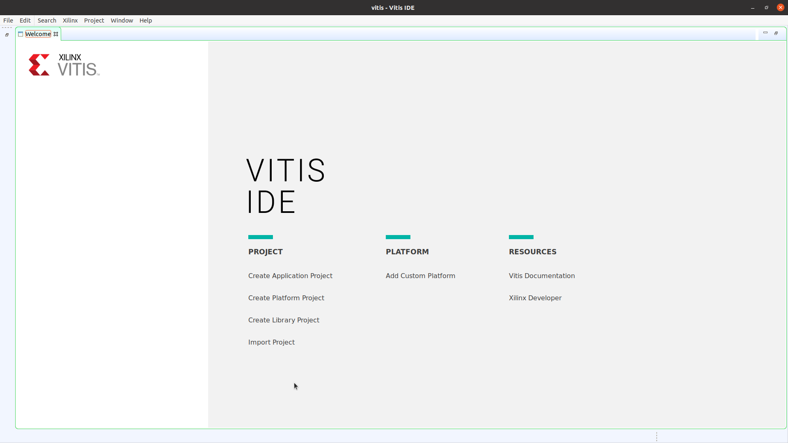

# Tutorial : Buttons and LEDs

In this tutorial, we are going to create a software application to run along our hardware design generated from Vivado.

## Prerequisites

1. Vitis 2022.1 accessible
2. Hardware XSA file from Vivado

### 1. Launch Vitis

If launching from the command line, Vitis can be launched as follows:
```sh
bash> vitis -workspace <PATH_TO_DESIRED_WORKSPACE_DIR> &> /dev/null
```

The above command assumes BASH shell is used and performs the follwoing:
- redirects both standard and error output streams to /dev/null (essentially turning off outputs on the console)
- sets the workspace directory for Vitis to the value provided for `<PATH_TO_DESIRED_WORKSPACE_DIR>` (if current directory is used, `<PATH_TO_DESIRED_WORKSPACE_DIR>` can be set to `.`)

The following window should open up


