# Tutorial : Buttons and LEDs

In this tutorial, we are going to create a Vivado design containing the following:
- AXI Timer
- LEDs
- Push Buttons
- 200MHz design clock

The targeted board is the Avnet IO Carrier Card + UltraZed SOM

## Prerequisites

1. Vivado 2022.1 accessible
2. Board files for Avnet boards are accessible from Vivado

### 1. Launch Vivado

If launching from the command line, Vivado can be launched as follows:
```sh
bash> vivado &> /dev/null &
```

The above command assumes BASH shell is used.
- Both normal output and errors are redirected to /dev/null
- Vivado is run in the background


### 2. Set Path for Board Files

in the `Tcl Console` on the bottom of the screen, point Vivado to the directory
containing board files for Avnet IO Carrier Card (let's call it REPO_PATH)
```sh
set_param board.repoPaths {REPO_PATH}
```

Enter the Tcl command above (with REPO_PATH substituted for the real directory path) and press ENTER.

> Note:
> Setting the repo path is usually done once. There is no need to reset the repo path every time Vivado is used unless the intent is to change it.


### 3. Create New Project

- click on `Create Project` to create a new project
- click `Next` from the new window

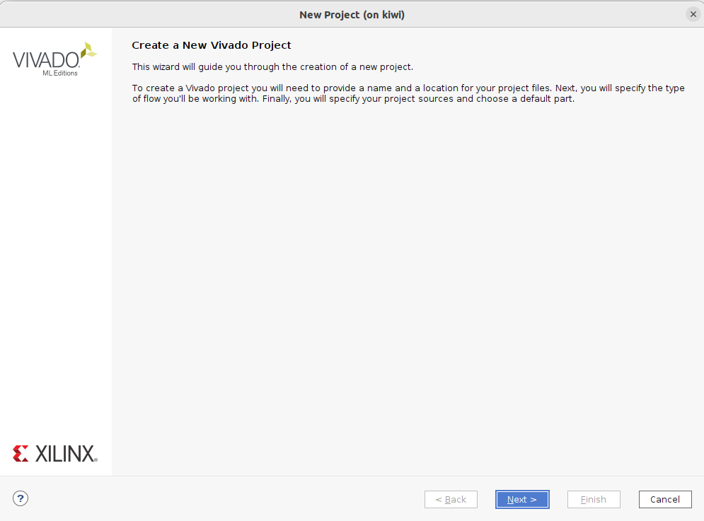

### 4. Set Project Name

On the new window screen,
- provide the name of the project (**btns_leds**)
- validate the `Project location` entry (user has read/write permissions to the path)
- check the `Create project subdirectory` option
- Click `Next`


### 5. Set Project Type

On the new window screen,

- select `RTL Project`
- check `Do not specify sources at this time` under the `RTL Project` choice
- click `Next`

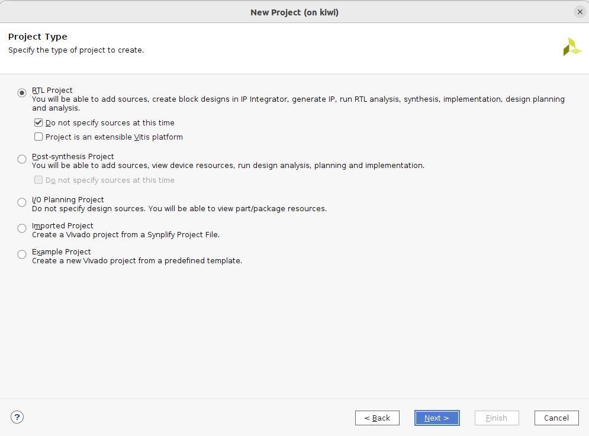

### 6. Select Target Board

- click on `Boards` near the top of the window
- type `carrier card` in the search bar
- click on `Avnet UltraZed-3EG IO Carrier Card` to select it
- click `Next`
- click `Finish` on the `New Project Summary` window that opens next


### 7. Create a Block Design

- on the left side of the main window (in the `Flow Navigator` pane), go to `IP INTEGRATOR`
and click `Create Block Design`
- then, on the `Create Block Design` window that opens:
    - change Design name to `system` (the name `system` isn't special. It's just our choice)
    - leave the Directory setting to `<Local to Project>`
    - leave `Specify source set` to `Design Sources`
    - click `OK`


- wait for the block design to be created. Then, a blank block design (like the one shown below) is created.


### 8. Add the ZynqMP Processor Subsystem

- click on the  button in the toolbar within the `Diagram` pane to open the search pane for the IP Integrator
- type `zynq` in the search box
- double-click on `Zynq UltraScale+ MPSoC` to add ZynqUltraScale+ processor subsystem to the block design


- the ZynqUltraScale+ processor subsystem should now be added to the block design as shown in the picture below:

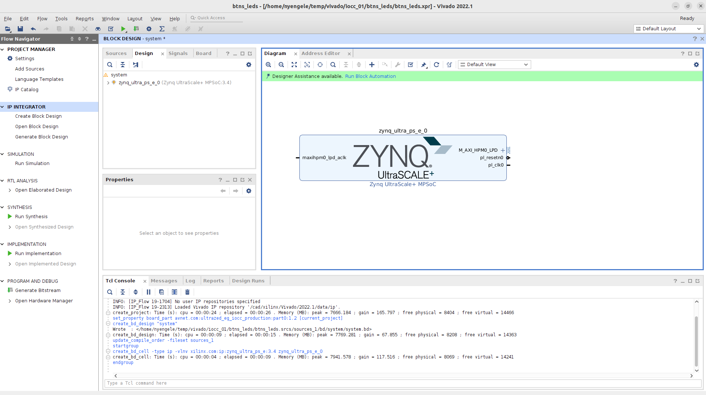

### 9. Configure ZynqMP Processor Subsystem

It is advantageous to use board files because most board-specific configurations for the processor subsystem can be automated. While it is possible to perform all customizations manually, in this tutorial we assume the use of board files.

- first, click on `Run Block Automation` in the `Diagram` pane to open the block automation dialog box


- make sure to check the `zynq_ultra_ps_e_0` option in the left pane and `Apply Board Preset` option in the `Options` sub-pane as shown in the image above
- click `OK` and the processor subsystem should be automatically configured as shown below

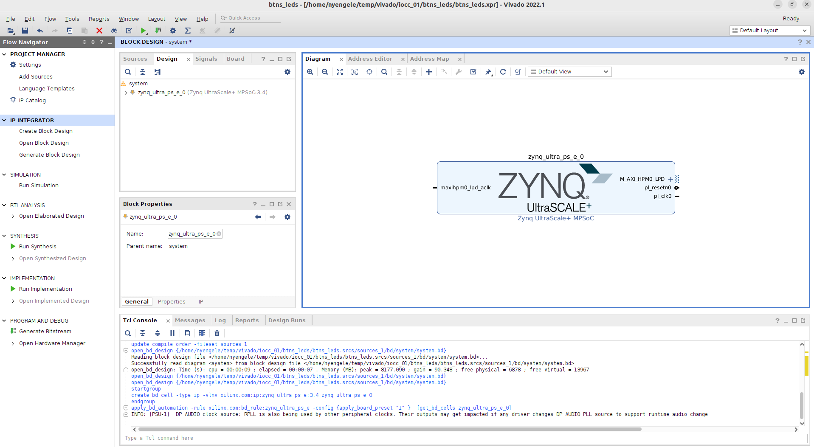

### 10. Enable Extra Interfaces in the PS (Processor Subsystem)

The presets for the PS used above do not enable interrupt lines between the programmable logic (PL) and the processor subsystem (PS). So we need to enable the interrupt interfaces.

- double-click on the PS block diagram to open the customization window
- once the customization window is opened, click on `PS-PL Configuration` within the `Page Navigator` pane on the left, then expend `General > Interrupts > PL to PS`
- select `1` for IRQ0[0-7] as shown in the picture below and then click `OK`

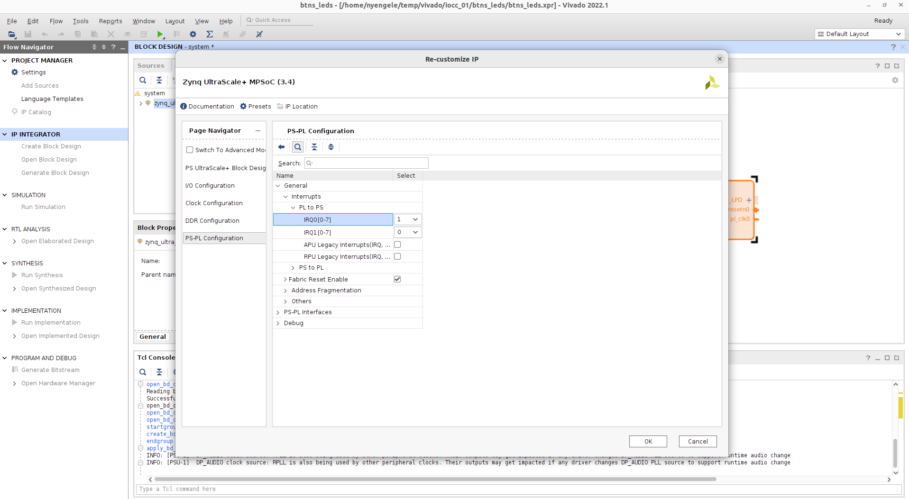

- the PS should now show the `pl_ps_irq0[0:0]` interrupt interface as shown below

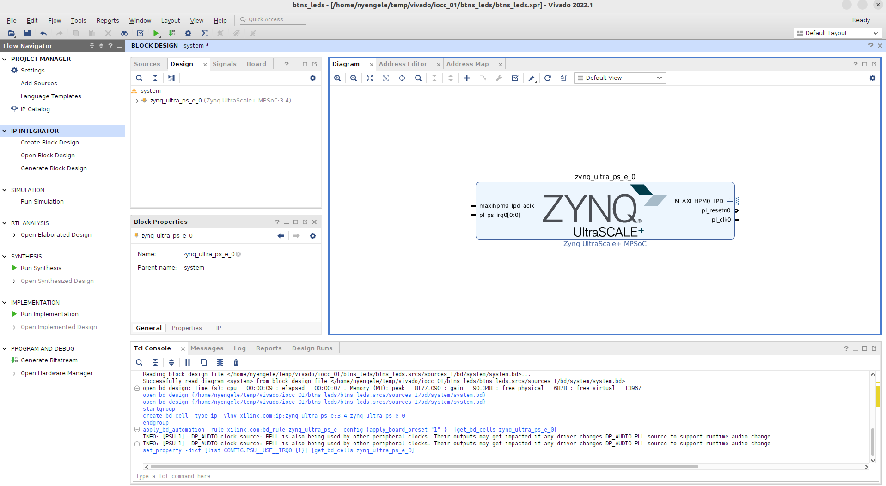

### 11. Adding Clock Generation Logic for the PL (Programmable Logic)

By default, the PL clock provided by the PS (`pl_clk0`) is typically a 100MHz clock.
However, in this design, we want to use a 200MHz clock. Fortunately, the ZynqUltraScale+ device provides a few primitives for generating clocks with different characteristics (frequency, phase, jitter, etc.).

-  click on the  button in the toolbar within the `Diagram` pane to open the search pane for the IP Integrator
- then search `clock` and double-click on the `Clocking Wizard` entry as shown below

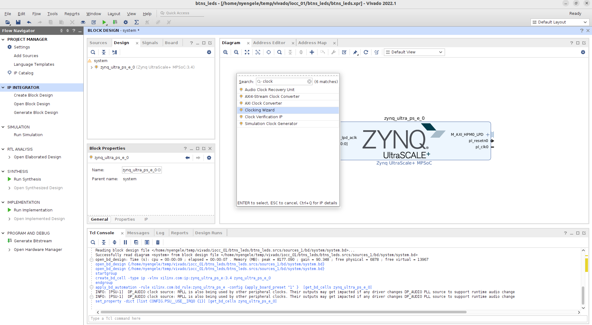

- once the clock wizard IP is ready, our block design should now look like the following image

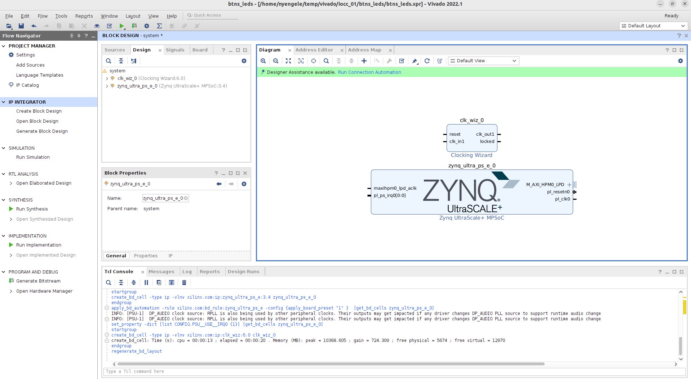

> Note:
> The placement of different blocks on the block diagram canvas might differ from one window organization to another.

To re-organize the placement of IP blocks on the block diagram canvas, click on the  button in the toolbar within the `Diagram` pane.
(I tend to regenerate the layout after adding 1 or 2 new IP blocks to the canvas).

We now want to configure the Clocking Wizard IP to generate a 200MHz clock and an active-low reset:
- double-click the Clocking Wizard block on the canvas to open the customization window as shown below


- there should only be one output clock enabled (`clk_out1`)
- change the `Port Name` of `clk_out1` to `system` (again, there is nothing special about this name)
- also change the `Output Freq (MHz) Request` field to `200.000` and press ENTER
- then scroll down to `Enable Optional Inputs/Outputs for MMCM/PLL` pane and change the reset type to `Active Low` as shown below

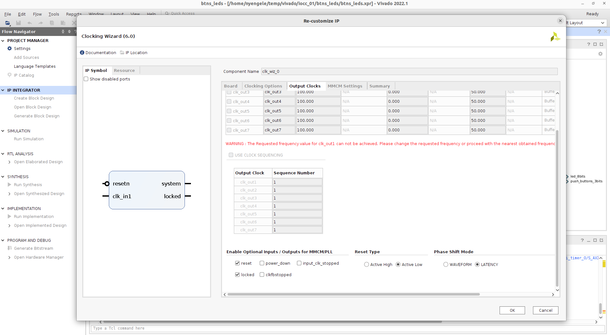
- click `OK`
- then on the block design diagram, connect the clk_wiz_0 instance as shown below (this is a good place to regenerate the layout)

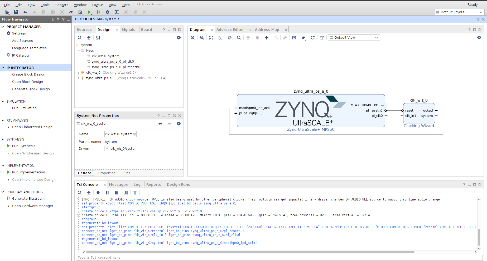

### 12. Adding Reset Generator

The provided reset `pl_resetn0` by the PS is synchronized to the `pl_clk0` clock. We want to create a reset signal that is synchronized to out `system (200MHz)` clock.

-  click on the  button in the toolbar within the `Diagram` pane to open the search pane for the IP Integrator
- search for `reset` and double-click on the `Processor System Reset` option as shown below


- once the reset block is added to the canvas, connect it to the rest of the system as shown below

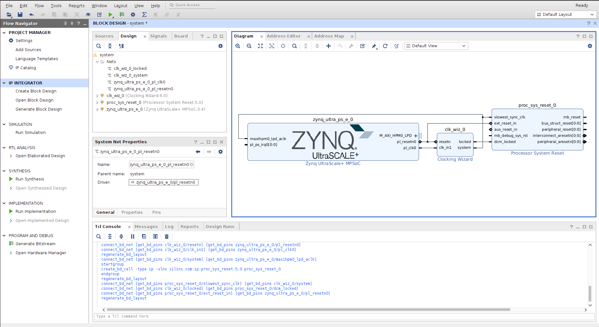

### 13. Add LEDs

The IO Carrier Card by Avnet contains a few LEDs on-board that are connected to some of the PS GPIO pins. In many instances, once would need to know exactly which pins are used to connect the LEDs in order to set up the right physical constraints (pin location, pin signaling type, pin drive strength, etc.). However, the board file for our IO Carrier Card already defines an LED board component with all that information specified. So all we need to do is find it and bring it on our block diagram.

- click on the `Board` tab in the `Sources` window pane
- then, click and drag `LED` under `General Purpose Input or Output` to the block design diagram. A pop-up dialog should show up to inform that an `AXI GPIO` IP was automatically added to the design and connected to the pins associated with the LEDs on the board (see image below for reference)


- now we need to connect the `AXI GPIO` IP to the PS so that it can be accessed from software
- click on `Run Connection Automation` link right below the toolbar in the `Diagram` window. The following connection automation window should show up

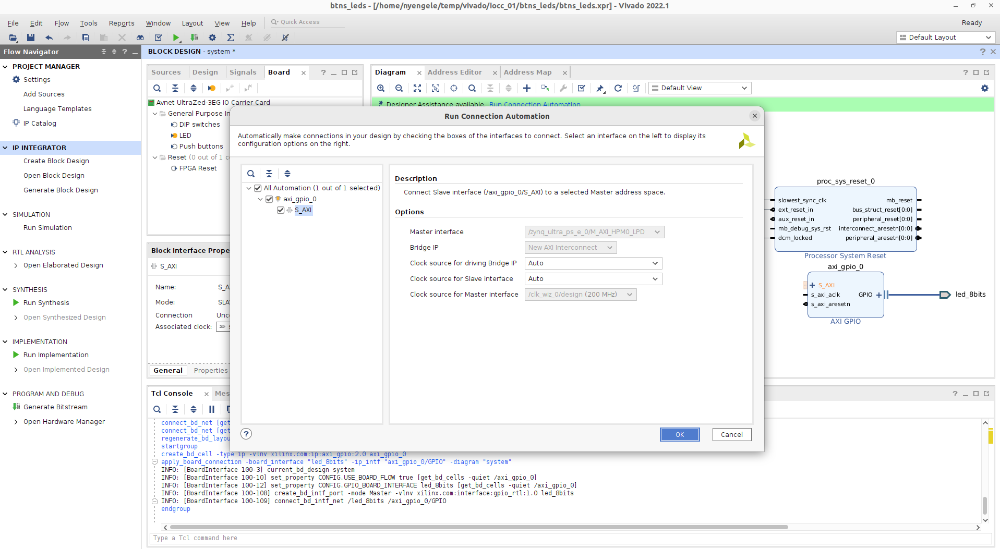

- make sure that both `axi_gpio_0` and `S_AXI` interface under it within the left pane are checked
- note that the master interface used is the `M_AXI_HPM0_LPD` AXI interface
- also note that the clock for Master interface is set to our 200MHz clock
- click `OK`
- The `AXI GPIO` IP instance `axi_gpio_0` should now be connected to the PS as shown in the figure below (check that the right clocks and resets are connected)

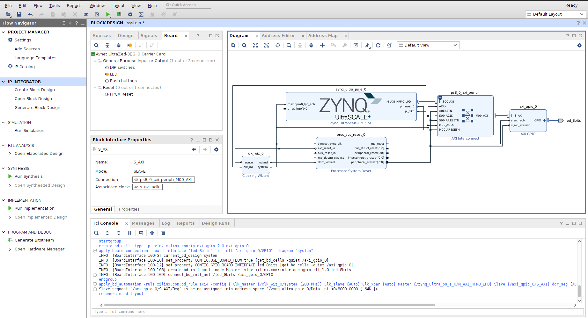

### 14. Add Push Buttons

Similar to the LEDs, push buttons on the IO Carrier Card are also included in the board file.
So we can follow the same procedure as that of LEDs to include the push buttons to our design.

- click on the `Board` tab in the `Sources` window pane
- click and drag `Push buttons` to our canvas
- a dialog box should pop up to indicate that the push buttons are now added to the second channel of our `axi_gpio_0` instance (this uses less IP blocks than instantiating a whole new AXI GPIO IP for the added push buttons)

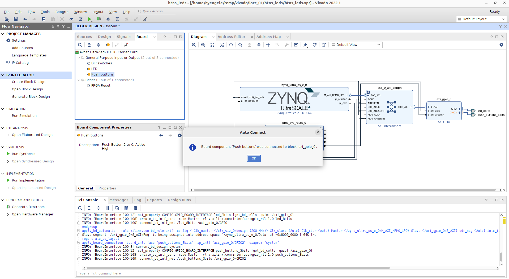

- after adding the push buttons, our block design should now look like the following (after regenerating the layout)

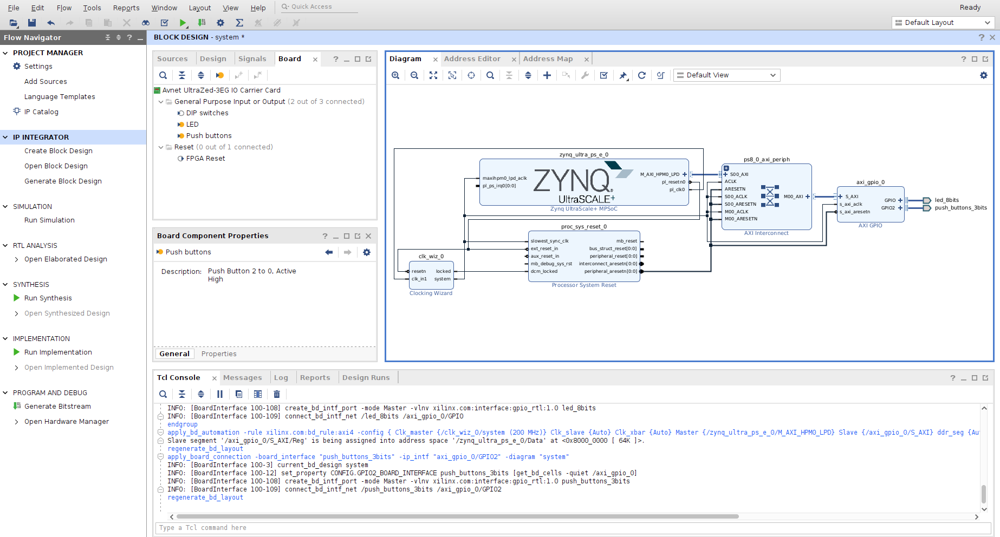

### 15. Add AXI Timer

We will use a hardware timer to schedule the execution of some code at a given interval.

- click on the  button in the toolbar within the `Diagram` pane to open the search pane for the IP Integrator
- search for `axi timer` and double-click on `AXI Timer` entry as shown below

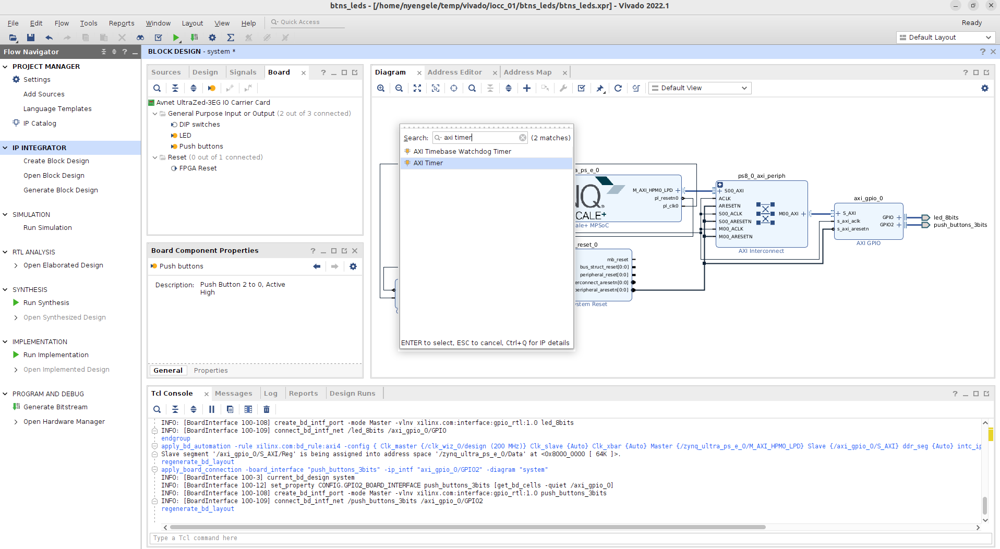

- once added to the canvas, double-click on the AXI timer to open its customization window as shown below


- in our case, we won't need any customizations (the defaults do just fine). So, click `OK` to close the customization window
- now we need to connect the AXI timer (`axi_timer_0`) to the PS, so click on `Run Connection Automation` to open the connection automation window as shown below


- make sure both of these options in the left pane are checked (`axi_timer_0` and the `S_AXI` interface under it)
- the master interface should be, again, the `M_AXI_HPM0_LPD` interface from the PS
- the clock source for Master interface should also be our 200MHz clock
- click `OK`
- the AXI timer should now be connected to the PS as shown below (after regenerating the layout)

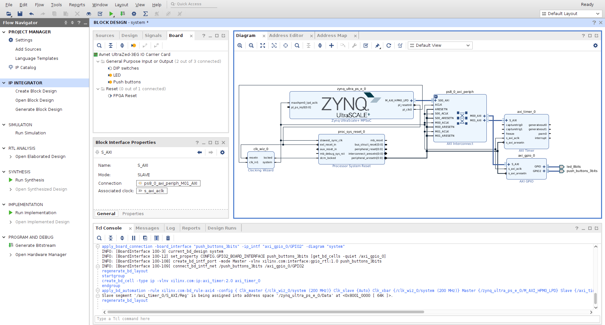

- now, from the block design diagram, connect the `axi_timer_0` interrupt pin (`interrupt`) to the `pl_ps_irq0[0:0]` pin on the PS as shown below

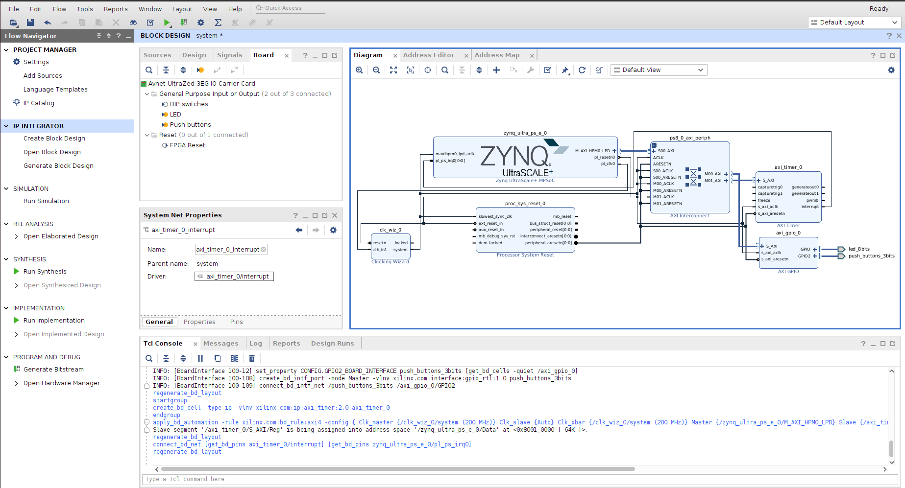

### 16. Validate Design

At this point, we are done with the block design and we want to validate it.
Validating the design accomplishes the following:
- runs DRCs on the whole design
- runs DRCs provided by each individual IP
- generates an address space for the PS and allocate address blocks to each software-accessible block in the design

- click on the  icon in the toolbar at the top of the `Diagram` window
- if there are no DRC violations, now the address allocations can be checked in the `Address Editor` window. If no addresses are generated and the design does not have DRCs, run the following command in the Tcl command line at the bottom of the window: `assign_bd_address`

### 17. Prepare Design for Synthesis

We now need to create a top-level wrapper for our entire design that will include our block design:
- click on the `Sources` window pane
- right-click on the `system.bd` entry listed under `Design Sources`
- click on `Create HDL Wrapper...` in the context menu that appears (see picture below)


- select `Let vivado manage wrapper and auto-update` option in the pop-up window as shown below


- wait for a little while for Vivado to create the wrapper. When done, a top-level Verilog file `system_wrapper` should be added to the `Design Sources` as shown below


### 18. Generate Bitstream

Now we're ready to synthesize the design and generate the bitstream for configuring the physical FPGA device that will run our design.

- click on `Generate Bitstream` under teh `PROGRAM AND DEBUG` section of `Flow Navigator` pane
- Vivado should pop up a dialog box indicating that no design implementation is found. This is right since we haven't synthesized and implemented our design for our particular FPGA device yet. Press `Yes` to let vivado launch synthesis and implementation before generating the bitstream


- a configuration window for the run should appear as shown below

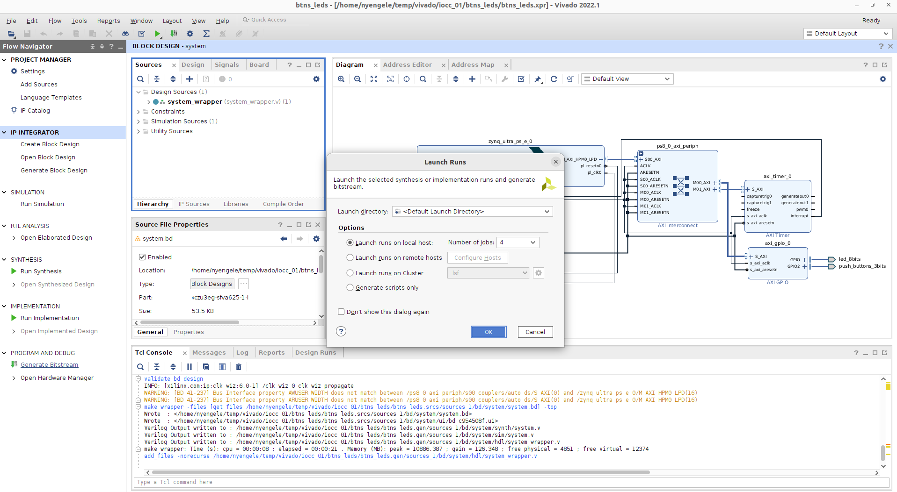

- leave all configurations to their default values except for `Number of jobs`
- `Number of jobs` should be set to the number of threads Vivado should use to run synthesis and implementation (by default, Vivado reports the number of CPU threads found on the machine)
- click `OK` after setting `Number of jobs` to the desired value
- when the runs have completed and the bitstream is generated, the following dialog box should appear

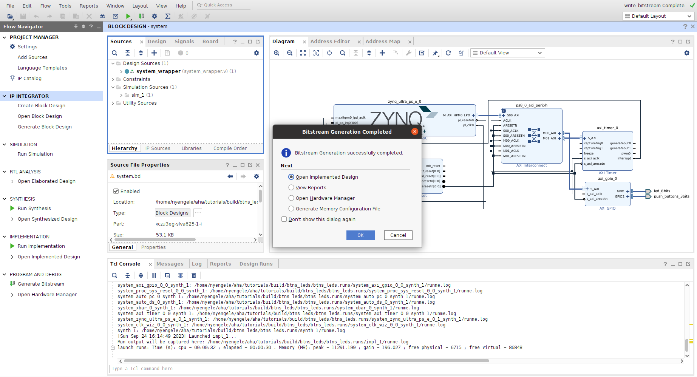

- click `Cancel` to close it

### 19. Export Hardware Design

At this point, we have the bitstream generated. However, we now would like to write the software code for the PS subsystem.
We will write software using `Vitis 2022.1`. But before that, we need to export the hardware design for Vitis to automate the customization of diverse components needed to run our software (boot loaders, PMU firmware, etc..)

- click on `File > Export > Export Hardware` as shown below to open the `Export Hardware Platform` window

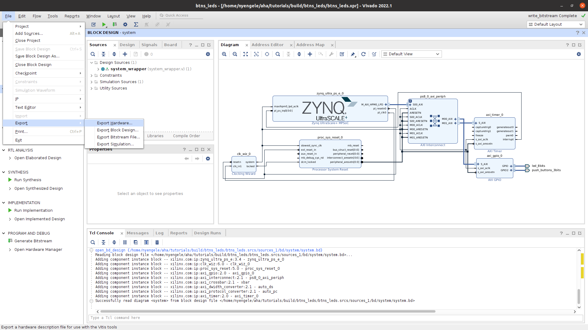

- The following window should show up


- click `Next`
- select `include bitstream` option in the next windows as below and then click `Next`

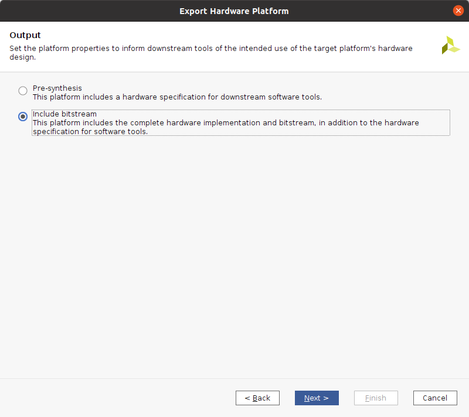

- in the next window, set the `XSA file name` to `system` and choose where to export the XSA hardware platform file (record this location because it will be needed in Vitis), then click `Next`

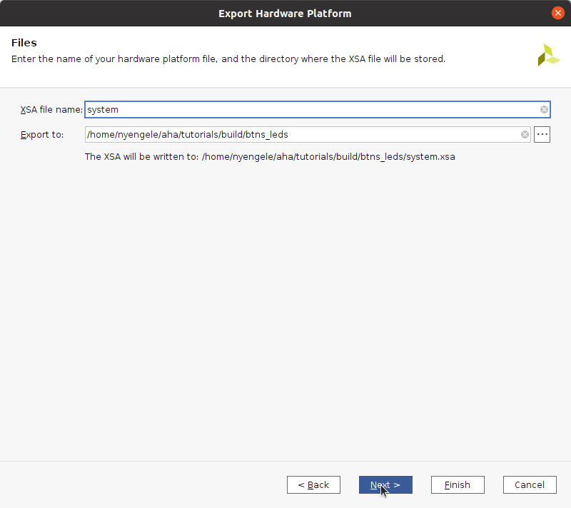

- a summary window like the one shown below should show up. Click `Finish` to generate the XSA hardware platform file


- once the XSA file is exported, close Vivado

This concludes the hardware design part of this tutorial. Now, we move to Vitis to create the software application.
